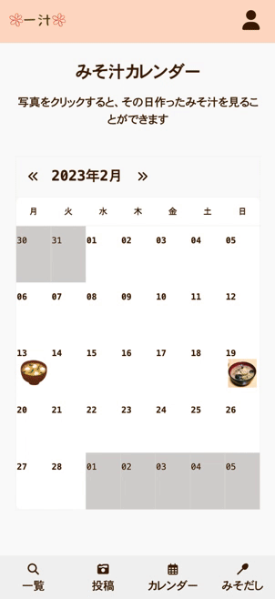

### https://www.ichiju.jp

 

## サービス概要

日々のごはん作りを頑張りたいあなたへ。 
まずは「みそ汁」から始めてみませんか？ 
一汁は、そんなあなたへ送る、ありそうでなかった「みそ汁」投稿サービスです。
 
 

## ターゲットユーザー

一人暮らしの会社員など、自分のご飯を自分で用意している人 
家族のために毎日料理を作っている人

ユーザーが抱える問題

- 健康や節約のために、自炊をしようと思っているが、日々忙殺されて習慣化できない
- 家庭料理のレシピがマンネリ化してしまう。

解決方法

「一汁」では、上記の問題に対して、みそ汁を用いた解決方法を提案します。

- みそ汁は非常にシンプルな作り方にも関わらず、たくさんの具材を入れることで栄養価の高いおかずとしても成り立つので、自炊習慣をつけるのに最適な一品です。「一汁」に作ったみそ汁を投稿し、「みそ汁カレンダー」を日々埋めていくことで、自炊継続を可視化することができます。また作ったみそ汁をユーザーに見てもらうことで、自炊のモチベーションアップに繋がります。
- 「一汁」に投稿されたみそ汁を閲覧し、作りたいレシピをブックマークすることができるので、明日作るみそ汁レシピに困ることはありません。また、みそ汁に欠かせない「おみそ」や「おだし」を探すこともでき、いつもとは違うみそ汁づくりにチャレンジすることもできます。

 
 

## このサービスを制作した背景

私自身一人暮らしで生活しており、日々の仕事や学習で毎日のご飯づくり億劫に感じ、つい出来合いのものに頼ってきました。
これは私と同じ境遇でなくても、人生のどのフェーズにおいても共感しうるものだと考えています（例えば「子育てで忙しい」「親の介護で忙しい」など）。
同時に、自炊を続けることによって健康維持・食費節約といった恩恵を受けられるため、「何とか自炊を継続化する方法はないか」と悩んでいました。 
そんな中、栄養価が高く、どんな具材を入れても様になり、作り方も単純な「みそ汁」は、それだけでお腹を満たすので、「自炊を習慣化したいけど、面倒臭い」と感じる全ての人の味方となるのでは？と思いつき、作成に至りました。
 
 

## 使用技術

### 全体構成

| バックエンド                                | フロントエンド                       | インフラ                               | API                      |
| :------------------------------------------ | :----------------------------------- | :------------------------------------- | :----------------------- |
| Ruby(3.1.3) Ruby on Rails(7.0.4)   | TailwindCSS DaisyUI JavaScript | PostgreSQL Heroku AWS(Amazon S3) | 楽天市場 API    |

### 主要ライブラリ（gem)

- `sorcery`（ユーザー登録、ログイン・ログアウト）
- `jp_prefecture`（都道府県情報の管理）
- `simple_calendar`（カレンダー機能）
- `carrierwave`（画像アップロード機能）
- `kaminari`（ページネーション）
- `draper`（decorator の導入）
- `enum_help`(enum の i18n 対応)
- `rakuten_web_service`（楽天市場 API の使用）
- `seed-fu`（データ作成）
- `dotenv-rails`(環境変数管理)
- `meta-tags`（OGP、メタタグの作成）
- `sitemap_generator`（サイトマップの作成）
- `whenever`（cron 設定）
- `rspec-rails`（テストフレームワーク）
- `rubocop`（Lint チェック）
   
   

## 機能紹介

(★ は未登録ユーザーでも楽しめます。)
 
 

### 主な機能

| みそ汁を探す                                                                       | みそ汁を投稿する                                                                 |
| :--------------------------------------------------------------------------------- | :------------------------------------------------------------------------------- |
|                                             |                                               |
| ★ フリーワードでみそ汁検索 ★ 食材タグでみそ汁検索 ★ 人気順にみそ汁を並べかえ | ・作ったみそ汁の写真を投稿 ・食材タグの設定 ・登録したおみそ・おだしの設定 |

 

| みそ汁カレンダーを見る                                 | おみそ・おだしを登録する                                                       |
| :----------------------------------------------------- | :----------------------------------------------------------------------------- |
|             |                                   |
| ・日々のみそ汁作りの記録 ・その日作ったみそ汁の確認 | ・お気に入りのおみそ・おだしの登録 ・出身地・居住地に基づいたレコメンド  |

 
 

### その他機能

★ ユーザー登録機能（ユーザーネーム・メールアドレス・パスワード） 
★ ログイン機能 
★ トップ画面表示 
★ 利用規約・プライバシーポリシー閲覧 
★ 管理者へのお問い合わせ 
・ プロフィール編集（アバター画像・名前・メールアドレス・出身地・居住地） 
・ みそ汁投稿へのいいね機能 
・ みそ汁投稿へのブックマーク機能 
・ ブックマークした投稿一覧を表示 
・ 投稿編集・削除機能 
・ 投稿 Twitter シェア機能 
 
 

## 画面遷移図

URL は[こちら](https://www.figma.com/file/byXYHVgoi48ftTHrX3LmpG/%E4%B8%80%E6%B1%81%EF%BC%8F%E7%94%BB%E9%9D%A2%E9%81%B7%E7%A7%BB%E5%9B%B3?node-id=0%3A1&t=DnZDzoEadONtC7uT-1)
 
 

## ER 図

 
 

## 開発スケジュール

企画〜技術調査：12/25 〆切 
README〜ER 図：12/25 
メイン機能実装：12/26 - 2/13 
β 版を RUNTEQ 内リリース（MVP）：2/13 
本番リリース：3/12
